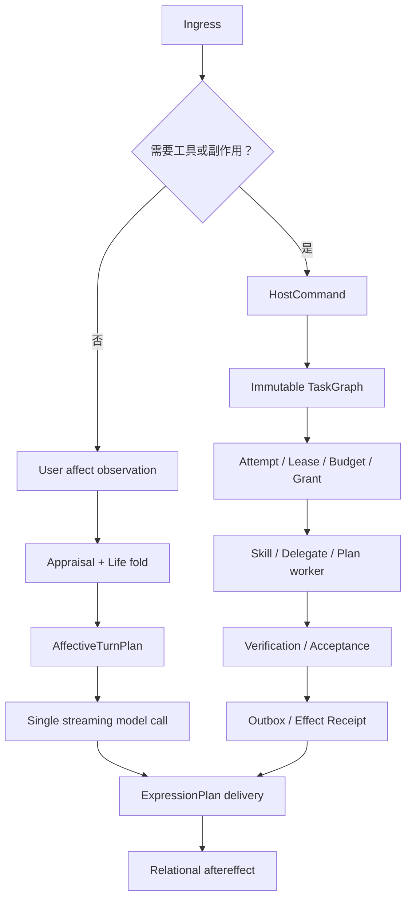

受众：CODEX
标题：图 02——实时陪伴与受管执行主链

# 图 02：实时陪伴与受管执行主链

```mermaid
flowchart TD
    IN["Ingress"] --> KIND{"需要工具或副作用？"}
    KIND -- "否" --> OBS["User affect observation"]
    OBS --> APP["Appraisal + Life fold"]
    APP --> PLAN["AffectiveTurnPlan"]
    PLAN --> MODEL["Single streaming model call"]
    MODEL --> EXPR["ExpressionPlan delivery"]
    EXPR --> AFTER["Relational aftereffect"]

    KIND -- "是" --> CMD["HostCommand"]
    CMD --> GRAPH["Immutable TaskGraph"]
    GRAPH --> NODE["Attempt / Lease / Budget / Grant"]
    NODE --> WORKER["Skill / Delegate / Plan worker"]
    WORKER --> VERIFY["Verification / Acceptance"]
    VERIFY --> EFFECT["Outbox / Effect Receipt"]
    EFFECT --> EXPR
```

普通聊天不创建重型 TaskGraph。任何外部写入、设备动作或工具调用仍走受管链。两条链只在已经冻结的表达与交付边界汇合。
