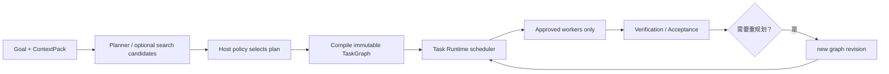

受众：CODEX
标题：图 04——计划草案与执行 authority

# 图 04：计划草案与执行 authority

```mermaid
flowchart LR
    GOAL["Goal + ContextPack"] --> CAND["Planner / optional search candidates"]
    CAND --> SELECT["Host policy selects plan"]
    SELECT --> COMPILE["Compile immutable TaskGraph"]
    COMPILE --> EXEC["Task Runtime scheduler"]
    EXEC --> WORK["Approved workers only"]
    WORK --> RESULT["Verification / Acceptance"]
    RESULT --> REPLAN{"需要重规划？"}
    REPLAN -- "是" --> REV["new graph revision"]
    REV --> EXEC
```

Planner 和模型只产出候选；Task Runtime 只执行已批准图。执行器不得在节点内部静默二次规划。失败重规划必须创建新 revision，旧图保持不可变。

普通情感对话不经过这条链，除非本轮确实调用工具、设备、Delegate 或外部写入。
