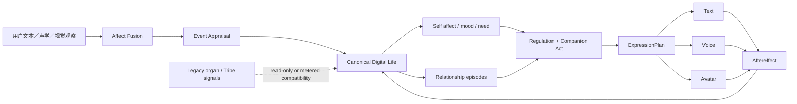

受众：MASTER
标题：图 05——七海情感生命拓扑

# 图 05：七海情感生命拓扑

```mermaid
flowchart LR
    U["用户文本／声学／视觉观察"] --> F["Affect Fusion"]
    F --> A["Event Appraisal"]
    A --> L["Canonical Digital Life"]
    L --> SELF["Self affect / mood / need"]
    L --> REL["Relationship episodes"]
    SELF --> ACT["Regulation + Companion Act"]
    REL --> ACT
    ACT --> EXP["ExpressionPlan"]
    EXP --> TXT["Text"]
    EXP --> VOI["Voice"]
    EXP --> AV["Avatar"]
    TXT --> AF["Aftereffect"]
    VOI --> AF
    AV --> AF
    AF --> L
    TRIBE["Legacy organ / Tribe signals"] -. "read-only or metered compatibility" .-> L
```

canonical Digital Life journal 是 self affect 与关系的写 authority。Limbic、BodySense、Endocrine、Motive 和 Tribe 等旧模块不能直接维护并行情绪真相。
