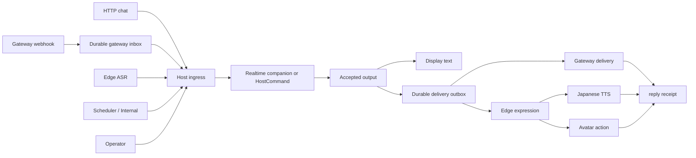

受众：CODEX
标题：图 06——输入输出路线

# 图 06：输入输出路线

```mermaid
flowchart LR
    WEB["HTTP chat"] --> IN["Host ingress"]
    GWH["Gateway webhook"] --> GWI["Durable gateway inbox"]
    GWI --> IN
    ASR["Edge ASR"] --> IN
    SCHED["Scheduler / Internal"] --> IN
    OP["Operator"] --> IN

    IN --> HOST["Realtime companion or HostCommand"]
    HOST --> ACCEPT["Accepted output"]
    ACCEPT --> TEXT["Display text"]
    ACCEPT --> OUTBOX["Durable delivery outbox"]
    OUTBOX --> GW["Gateway delivery"]
    OUTBOX --> EDGE["Edge expression"]
    EDGE --> TTS["Japanese TTS"]
    EDGE --> AV["Avatar action"]
    GW --> RECEIPT["reply receipt"]
    TTS --> RECEIPT
    AV --> RECEIPT
```

重复 webhook 不能重复创建任务，重放 outbox 不能重复外发。文本、TTS 和 Avatar 各自终结，但共享同一表达 revision 与 synchronization identity。
